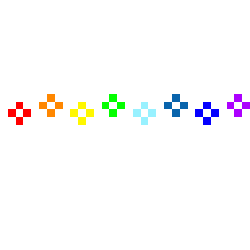

<a href="https://komarev.com/ghpvc/?username=euna">
  
</a>



<p align="center">
<a href="https://git.io/typing-svg"></a>

	
</p>
<!-- Intro  -->
<h3 align="center">

  <br>
  <samp>&gt; Hey There!, I am <b><a target="_blank" href="https://euna.com">Euna Angeles</a></b></samp>
</h3>

<p align="center"> 
  <samp>
    「 I am BSIT-BA student from Feu Tech! 」
    <br>
	      <a> 🫧𓇼𓏲*ੈ✩‧₊˚🎐 </a>
  </samp>
</p>

<p align="center">
 <a href="https://eyuewna" target="blank">
  
 </a>
 <a href="https://www.linkedin.com/in/euna-angeles-128629298/" target="_blank">
  
 </a>
 <a href="https://www.facebook.com/eunagabriellev.angeles" target="_blank">
  
  </a> 
 <a href="https://open.spotify.com/user/315cx7at3myqejzytpuguvaxquhy" target="_blank">
  
 </a>
 <a href="https://www.instagram.com/yuuuena/" target="_blank">
  
 </a> 
</p>
<br />


<!-- About Section -->
 # 𝓐𝓫𝓸𝓾𝓽 𝓶𝓮
 
<p>
  
  <pre><code>```js
"use creativity";
import { Person } from 'Manila, Philippines';

new Person({
    👩🏻 name       : 'Euna Gabrielle V. Angeles',
    🎂 age        :  '20 yr old :,D',
    💁🏻‍♀️ pronouns   : 'she/her',
    ❤️ likes      : 'matcha, cats, music, programming <3',
    📧 email      : 'eunaangeles@gmail.com',
    🌐 website    : 'ongoing',
    🟢 Status     : 'Alive',
    😬 stressed   : true
    💬 Ask Me     : [here](https://github.com/eyuewna/eyuewna/issues)
}).sayHello();
  </code></pre>

```
```cmd
D:\Euna-Angeles> index.js
🎯 𝐹𝓊𝓉𝓊𝓇𝑒-𝐹𝑜𝓇𝓌𝒶𝓇𝒹 𝐵𝓊𝓈𝒾𝓃𝑒𝓈𝓈 𝒜𝓃𝒶𝓁𝓎𝓈𝓉

```
 
</p>

## 𝓤𝓼𝓮𝓭 𝓽𝓸 𝓒𝓸𝓭𝓮


<br/>


## 𝓜𝔂 𝓡𝓮𝓹𝓸𝓼𝓲𝓽𝓸𝓻𝓲𝓮𝓼 /ᐠ≽•ヮ•≼マ
<div>
  <p align="center">
	    <a href="https://github.com/eyuewna/AWD-Animation-project">
      		
    	</a>
	    <a href="https://github.com/eyuewna/Jumping_Letters">
      		
    	</a>
    	<a href="https://github.com/eyuewna/Bell_Notification">
      		
    	</a>
    	<a href="https://github.com/eyuewna/Color_Switching">
      		
    	</a>
    	<a href="https://github.com/eyuewna/Angeles-Calculator">
      		
    	</a>
    	<a href="https://github.com/eyuewna/CatCafe-Website">
      		
    	</a>


## 𝓖𝓲𝓽𝓱𝓾𝓫 𝓢𝓽𝓪𝓽𝓾𝓼 (·•᷄‎ࡇ•᷅ )
<br/>

<p align="center">
  <a href="https://github.com/eyuewna">
    
  </a>
</p>

<p align="center">
  <a href="https://github.com/eyuewna">
    
  </a>
</p>

<a> 
    <a href="https://github.com/eyuewna"></a>
  <a href="https://github.com/eyuewna"></a>
  <br/>
</a>


<p align="center">
<a href="https://git.io/typing-svg"></a>
<p align="center">

